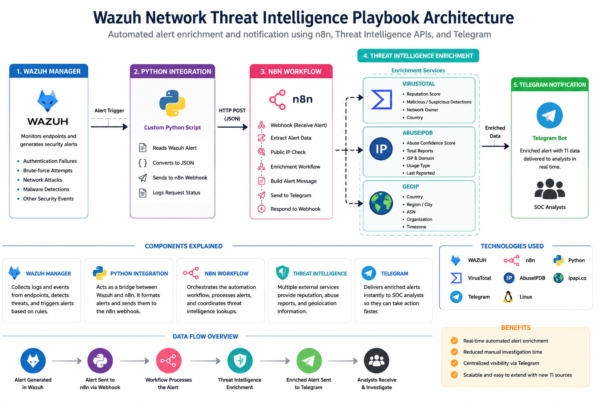
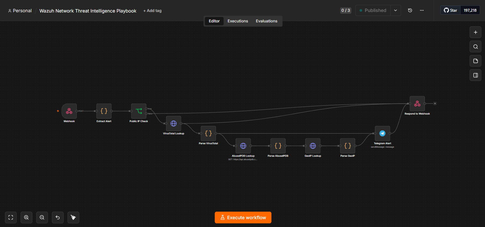
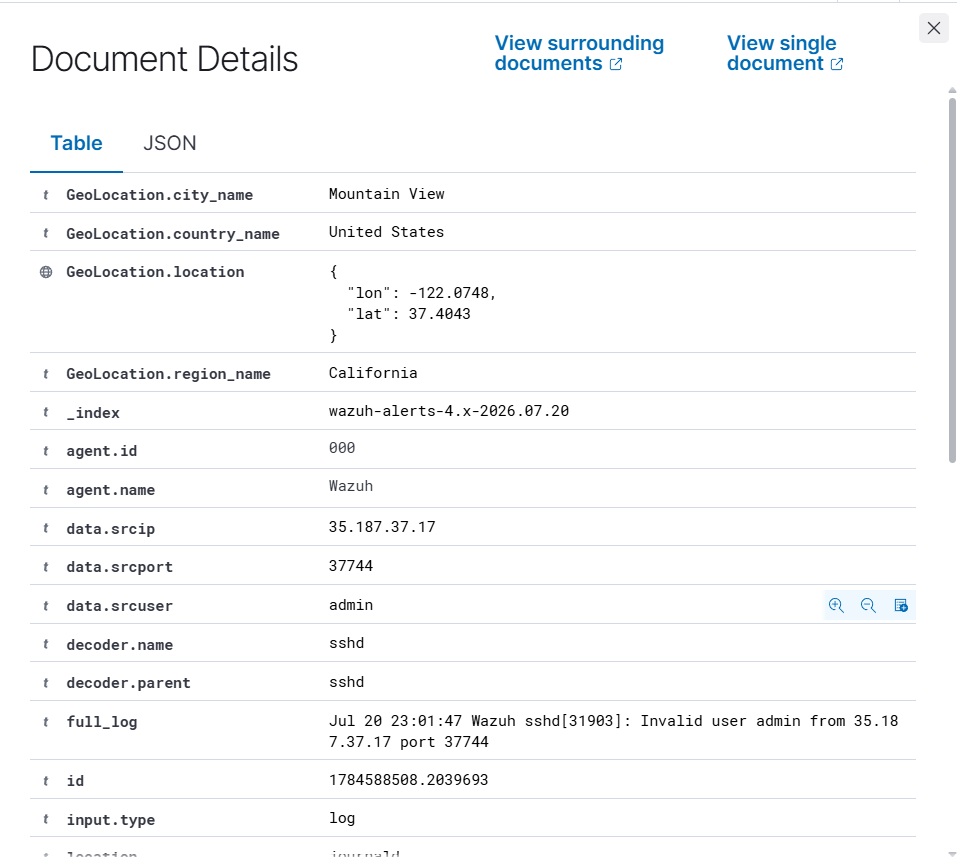
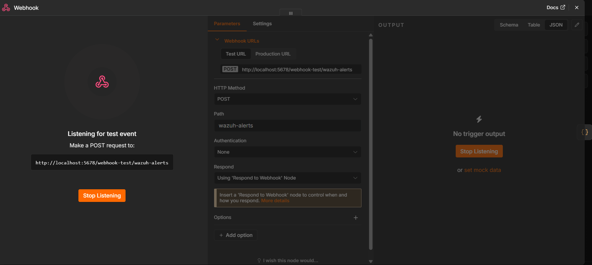
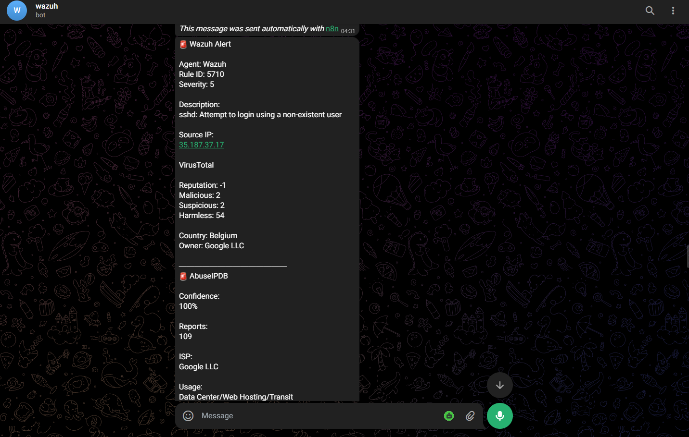

# 🛡️ Wazuh Network Threat Intelligence Playbook


Automate **Wazuh** security alerts using **n8n** and enrich them with **VirusTotal**, **AbuseIPDB**, and **GeoIP** before sending real-time notifications to **Telegram**.

This project demonstrates how a Security Operations Center (SOC) can reduce manual investigation time by automatically enriching suspicious IP addresses with multiple threat intelligence sources.

It is designed for:

- 👨‍🎓 Students learning Cybersecurity
- 🛡️ SOC Analysts
- 🔵 Blue Team Engineers
- ⚙️ Security Automation (SOAR) enthusiasts
- 🚀 Anyone learning Wazuh and n8n

---

# 🏗️ Architecture



---

# 📖 Project Overview

When Wazuh detects a suspicious security event (such as an SSH brute-force attempt), analysts usually need to manually investigate the source IP.

Typical investigation steps include:

- Copy the source IP
- Search VirusTotal
- Search AbuseIPDB
- Check the IP location
- Determine whether the activity is malicious

This project automates the entire investigation process.

Within seconds, an enriched alert is delivered directly to Telegram, allowing analysts to make faster decisions.

---

# ⚙️ Workflow

```
Wazuh
    │
    ▼
Python Integration
    │
    ▼
n8n Webhook
    │
    ▼
Extract Alert
    │
    ▼
Public IP Check
    │
    ▼
VirusTotal Lookup
    │
    ▼
AbuseIPDB Lookup
    │
    ▼
GeoIP Lookup
    │
    ▼
Telegram Notification
```

---

# 📷 Workflow Overview



The workflow receives alerts from Wazuh, enriches them with multiple threat intelligence sources, and sends the results to Telegram automatically.

---

# 📱 Demo

## Wazuh Alert



---

## n8n Workflow Execution



---

## Telegram Alert



---

# 🚀 Features

- ✅ Automated Wazuh alert processing
- ✅ Public IP validation
- ✅ VirusTotal IP reputation lookup
- ✅ AbuseIPDB reputation lookup
- ✅ GeoIP enrichment
- ✅ Real-time Telegram notifications
- ✅ Python integration with Wazuh
- ✅ Low-code automation using n8n
- ✅ Beginner-friendly documentation
- ✅ Easily extensible for additional threat intelligence sources

---

# 🛠 Technologies Used

| Technology | Purpose |
|------------|---------|
| Wazuh | SIEM & Security Monitoring |
| n8n | Workflow Automation |
| Python | Wazuh Custom Integration |
| VirusTotal API | Threat Intelligence |
| AbuseIPDB API | IP Reputation |
| GeoIP API | Geolocation |
| Telegram Bot | Notifications |
| Ubuntu Linux | Wazuh Server |

---

# ✅ Prerequisites

Before using this project, make sure you have:

- Ubuntu Linux
- Wazuh Manager
- Python 3
- n8n
- Telegram Bot
- VirusTotal API Key
- AbuseIPDB API Key

---

# 🚀 Quick Start

Clone the repository:

```bash
git clone https://github.com/ashwanth-saran/wazuh-network-threat-intelligence-playbook.git
```

Then:

1. Install and configure Wazuh.
2. Copy the Python integration.
3. Import the n8n workflow.
4. Configure your API credentials.
5. Activate the workflow.
6. Generate a Wazuh alert.
7. Receive enriched alerts in Telegram.

---

# 📂 Repository Structure

```text
wazuh-network-threat-intelligence-playbook
│
├── architecture/
│   ├── architecture-diagram.png
│   └── README.md
│
├── docs/
│   ├── Installation.md
│   ├── Workflow.md
│   └── Troubleshooting.md
│
├── integrations/
│   ├── custom-n8n.py
│   └── README.md
│
├── n8n/
│   ├── network-threat-intelligence.json
│   └── README.md
│
├── screenshots/
│   ├── workflow-overview.png
│   ├── wazuh-alert.png
│   ├── n8n-execution.png
│   └── telegram-alert.png
│
├── LICENSE
├── .gitignore
└── README.md
```

---

# 📚 Documentation

Detailed documentation is available throughout the repository.

- 📖 [Installation Guide](docs/Installation.md)
- 🔄 [Workflow Explanation](docs/Workflow.md)
- 🛠️ [Troubleshooting Guide](docs/Troubleshooting.md)
- 🏗️ [Architecture Documentation](architecture/README.md)
- 🔗 [Integration Guide](integrations/README.md)
- ⚙️ [n8n Workflow Guide](n8n/README.md)

---

# 🎯 Future Improvements

This project is the first playbook in a larger SOAR platform.

Future enhancements include:

- 📁 File Integrity Monitoring (FIM)
- 🪟 Windows Authentication Monitoring
- 🦠 Malware Hash Analysis
- 🌐 Web Attack Detection
- 📊 Risk Scoring Engine
- 🤖 Automated Response Actions
- 📧 Email Notifications
- 💬 Slack Integration
- 🔷 Microsoft Teams Integration
- 🌎 GreyNoise Integration
- 👁️ AlienVault OTX Integration
- 🔍 Shodan Integration

---

# 🤝 Contributing

Contributions are welcome.

If you have ideas for improvements, bug fixes, or new threat intelligence integrations, feel free to:

- Open an Issue
- Submit a Pull Request
- Share suggestions

---

# 👨‍💻 Author

**Ashwanth Saran JC**

Cybersecurity Enthusiast | SOC Analyst | Security Automation

GitHub: https://github.com/ashwanth-saran

LinkedIn:
https://www.linkedin.com/in/ashwanthsaran08/

Portfolio:
https://ashufoilo.netlify.app/

---

# 📄 License

This project is licensed under the MIT License.

See the **LICENSE** file for details.

---

⭐ If you found this project useful, consider giving it a star.

Feedback, suggestions, and contributions are always welcome.
